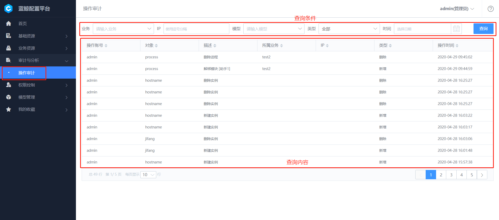

### cmdb平台的介绍

#### 【首页】
- 如下图所示：红色椭圆形框可以输入ip查询到该ip术语哪个主机
- 如下图所示：红色横向框展示的是对上一次登陆功能使用记录的展示，以及最下方主机管理功能、模型功能的直观展示，可以直接进入到该模型查询数据，省去了需要在左侧功能栏才能进入到对应的功能查看数据的繁琐步骤。
- 如下图所示：也可以对某个功能进行收藏(红色竖向框)。

   
d   
#### 【基础资源】

**1. 业务**
- 在作业平台、监控、标准运维等系统中，均以已有 业务 为基础进行运作。 业务是蓝鲸持续部署环节比较重要的概念，主要用于资源和配置隔离，在配置平台创建的业务，默认同时应用于作业平台、标准运维、蓝鲸监控、故障自愈等场景。
- 用户在有权限的基础上对业务进行管理，包含查看业务列表，新建、归档及还原等操作。
- 如下图所示：点击“新建”可以创建自己的业务，填写新建业务的基础信息，包含业务名称，产品人员，业务运维等字段
- 如下图所示：右边的俩个图案依次的作用是可以查看删除历史、列表显示属性配置

   

- 如下图所示：点击业务可以对其属性进行编辑、归档（蓝鲸本身的业务无法归档）；对其关联进行管理；以及查看该业务的变更记录

   

**2. 主机**

- 为了标准化管理和提高主机资源利用率，设计了资源池模式，所有主机需要统一先录入到主机资源池中，然后再分配至具体的业务下的空闲机池，同时也可以删除不需要的主机。核心功能包含主机的录入、分配到业务、删除主机等。

- 目前在配置平台导入主机分以下两种，一种是 Excel 批量导入。另一种是通过 节点管理 进行导入。

   

#### 【业务资源】
业务资源是集合了对业务层管理的使用功能，包含业务主机、业务拓扑、进程管理、动态分组 4 个功能板块。实现业务的精细划分以及拓扑直观展示。

**1. 业务主机**

默认从主机资源池分配到业务的主机会放到 "空闲机" 模块下，我们需要分配到具体的业务模块中，以进行合理的资源管理。

**2. 业务拓扑**

业务拓扑是对部署结构的一种抽象表示，是配置平台进行主机管理的基础，在业务架构以及类型越来越复杂的今天，只有建立合适的业务模型，才能结构化的管理好主机。配置平台提供用户结构自定义、拓扑属性自定义等功能

   

**3. 进程管理**

1）相关描述
- 模块被定义为一组强相关进程的集合，"进程管理" 功能可以帮助业务管理进程端口等基础信息，比较典型的应用场景有蓝鲸的监控系统对进程进行监控。
- 一个模块下的服务器通常执行的是同一个功能，由一个或者多个业务进程构成，"进程管理" 功能可以帮助业务管理进程以及其端口、进程和模块的绑定关系。在监控系统中也会用到此特性。
- 新建进程，创建一个进程，支持三种模式

   - 没有监听端口的进程
   - 监听一个端口的进程
   - 监听多个端口的进程
- 在新增进程的高级属性下，可以保存进程更加详细的信息，包含：启动命令，停止命令，重启命令，自动拉起选项等。需要注意的是，配置平台只是作为进程端口信息的存储，在蓝鲸监控系统或者用户自定义的应用中实现具体功能。

- 进程绑定模块，新增了一个自定义进程以后，可以通过 "绑定" 功能，把进程绑定到之前定义的业务模块上。在真实运营场景中，其他系统通过查询模块下的主机，可以最终得到哪些主机上运行了哪些进程。

2）新建业务进程
- 通过左侧导航打开 "业务资源 - 进程管理" 功能页，点击 【新建】按钮。

   

- 进程相关的重要名词解释：

  - 进程名称：进程的唯一标识，便于用户区分出业务下不同的进程，名称需要保证业务下唯一。
  - 功能名称：程序的二进制名称，比如 Zookeeper 的二进制名称是 java，则填写 java。
  - 进程描述：对于进程的进一步详细描述，也可以理解为此进程的备注信息。

- 端口：当进程启动会监听端口时，可以根据进程实际情况填写端口信息，填写规则有：

  - 单个进程填写 80；
  - 多个进程填写 80,90，表示进程监听了 80,90 两个端口，以逗号隔开；
  - 多个连续进程填写 80-90，表示进程监听了 80，81，82...89，90 一共 11 个端口；
  - 混合包含连续和不连续端口填写 80,90-92，表示监听了 80，90，91，92 一共 4 个端口；

- 协议：所监听端口的使用的协议，当前支持配置 TCP，UPD 两种协议。

- 绑定 IP： 所监听端口绑定在哪个 IP 下，可选项有 0.0.0.0、127.0.0.1、第一内网（ "内网 IP" 字段记录的 IP）、第一外网（ "外网 IP" 字段记录的 IP）。

- 此外，更多属性分组里可以配置进程的更多信息，如功能 ID、工作路径、启动命令、启动用户等，因对应的进程管理 SaaS 尚未内置到蓝鲸中，用户可选配置。

3）绑定进程到模块

- 在配置平台设计中，主机资源一定属于某个业务模块，进程通过绑定到模块，可以很方便的批量把进程信息配置到主机之上。通过主机和进程的关系，进而实现主机上进程监控或者对进程进行启停等管理。

- 点击一个已经创建好的进程，切换到模块绑定 Tab 标签，点击目标模块后方的 【未绑定】 按钮，完成对模块的绑定。

   

**4. 动态分组**

- 当业务下的拓扑结构过于复杂的时候，可以通过动态分组功能，定义常用的查询条件。例如：集群属性的 “服务状态” 为 "开放" 的主机列表。这些动态分组可以直接在作业平台、标准运维中对主机进行查询的时候使用。

- 用户可以在配置平台点击新增一个动态分组，在新增时首先选择分组对象，是针对集群、模块还是主机以及分组期望的输出是什么。然后选择与或非逻辑是等于、不等于还是存在或者不存在，选择好与或逻辑之后输入期望的的值，点击预览则会展示当前分组的输出，同时分组支持多个条件的组合

1）动态分组列表
- 可以在 "业务资源 - 动态分组" 看到当前业务下的已经配置的查询列表

   

2)新增动态分组
- 通过点击 新增 增加一个动态分组。

- 配置分为两方面的内容：

  - 分组内容：是指分组后期待页面显示的字段内容都有哪些。
  - 分组条件：是指根据怎样的条件将主机划分到不同的组内

   

#### 【审计与分析】
所有用户在配置平台上的操作，都有对应的记录可以追溯，用户可以在操作审计菜单项下查看具体的历史操作

**1. 操作审计**

操作审计是面向管理员功能，能够查询到所有用户在配置平台上的操作。通过导航打开 "审计与分析 - 操作审计" 进入功能页

   

#### 【权限控制】
配置平台支持两层权限配置：业务功能权限管理、系统功能权限管理

**1. 业务功能权限管理**
- 当新建业务时，"业务运维" 被认为是业务的主要负责人，默认拥有此业务最高权限，包含业务下所有集群、模块、主机等的管理权限。如下图配置，bwang(bb) 用户拥有 "测试" 业务所有的权限。

   

- 默认状态下，产品、测试、开发、操作人员可以在配置平台看到业务的资源情况，但是对业务下数据没有修改权限。管理员可以根据企业的实际需要，授予角色特定的权限
- 默认状态下，运维人员有所有的权限，不可更改，如下图：

   

- 具体操作可以通过侧边导航打开 "权限控制-业务权限管理"，选择目标角色，勾选需要授予的权限即可

   
- 需要注意的是，这里角色的权限配置是对整个企业的所有业务生效，而非单个业务

**2. 系统功能权限管理**
- 对于和业务没有直接关系的功能，如系统功能、普通自定义实例，管理员可以通过常用的 "角色+权限" 方式设定权限。以下以网络设备管理员为例，分为两个步骤设定角色权限：

(1) 创建角色

- 通过侧边导航打开 "权限控制-系统权限管理"，点击 新建 打开对话框
- 角色名填写 "网络管理员" ，成员中指定需要授权的人员，这里设定了 bwang(bb) 为网络管理员

   

(2) 角色授权

- 通过角色创建以后，可以在角色列表中看到新增的角色，点击 【权限详情】 按钮进入权限配置页，可以对该角色的权限进行相应的设置

   

####             【模型管理】

配置平台提供了灵活的模型定义功能，支持企业根据自身的业务架构，进行自定义特定的信息模型。

配置平台中管理的信息实例，均是基于模型构造而成。目前内置的模型有业务、集群、模块、主机、进程、云区域。如果内置模型不能够满足，可以通过自定义新增、编辑模型，从而构造出企业特有的 CMDB。

需要注意的是，模型管理定位为配置平台的底层功能，需要配置平台管理员权限才可以操作。

**1. 模型**

配置平台内置的模型有业务、集群、模块、主机、进程、云区域，此外还可以通过自定义新增模型。 支持现有模型查看、模型分组、模型创建、模型编辑、模型字段唯一校验、模型字段分组、模型删除、模型从停用恢复、模型字段导出和导入等。

- 查看现有模型

  - 使用管理员账户登录以后，可以通过 "模型管理 - 模型" 中查看到当前系统中存在的模型。

   

  - 查看现有的某个模型下的相关属性

   

- 模型分组

  - 系统支持对模型按照使用的功能进行分组。分组有 "系统内置" 和 "用户自定义"

  (1)系统内置
  - 目前包含 "主机管理"、"业务拓扑"、"组织构架"、"网络"、"中间件"，内置分组不可以编辑，但可以在其下建立模型。

  (2)用户自定义分组：
  - 新建分组：可以通过 【新建分组】 按钮进行新增。需要注意的是，分组名称在系统中具有唯一性。

   

  - 编辑分组：点击分组名右侧的 【编辑笔】 按钮对名称进行调整

   
   

   - 删除分组：选中目标分组，点击右侧 【删除】 按钮。需要注意的是，只有当分组下没有模型的时候，才可以删除此分组

   

- 新建模型

  - 配置平台内置一些通用的模型，当现有的模型不能够满足需要的时候，可以通过新建的方式增加模型。

  - 点击左上角的 【新建模型】 按钮，打开新增模型的对话框，然后选择所属分组，选择模型图标（后续可自定义图标），填写模型唯一标识以及名称，最后点击保存新建完成。

   
   

- 模型编辑
  - 模型创建完之后，可以修改模型的名称、图标。但唯一标识不能修改。

   

- 模型字段唯一校验

  - CMDB 设计了唯一性校验以避免出现重复的脏数据，即有以下逻辑：

    - 创建实例时，如果发现唯一校验规则出现重复，会认为是错误请求而阻止创建。
    - 编辑实例时，通过唯一规则找到确定的一个实例，如果发现匹配多个实例或者实例并不存在，系统会判定为一次错误编辑请求。

  - 管理员在创建一个全新的自定义模型时，会自动内置 bk_inst_name 字段，并默认设定作为唯一校验字段

  - 管理员可以根据实际的数据实例管理需要，设定多种规则如下：

    - 多组规则独立判定。例如：对于服务器，同时设定数据实例必须满足 "固资编号" 和 "设备 SN" 同时满足全局唯一。
    - 单组规则包含多个字段，实现联合唯一判定。例如：对于机架，必须满足 "机房名 + 机架名 唯一"， "机房名：东莞机房，机架名：机架 1" 与 "机房名：东莞机房，机架名：机架 2" 认为合法。

  - 通过以下步骤可以实现唯一校验规则的修改或新建：

    - 通过导航点击 "模型 - 选中需要修改的模型"，进入模型列表页面，找到需要修改的模型，点击进入对应的管理界面。
    - 切换到 "唯一校验" 功能面板，即可对需要调整的分组进行编辑，或者新增行的校验分组。

   

   - 需要注意的是，校验分组有 "是否为必须校验" 的设定，一个模型只能够设定一组校验规则为 "必须校验"，其他分组为非必须。非必须分组当用户没有填写字段值时，不会触发校验。此外系统内置的关键模型为了保证系统的正常运作，不允许修改 "必须校验" 分组

- 模型字段分组
  - 实际应用中，对于模型的属性字段，我们需要对其进行归类排序，这时候可以使用字段分组功能。在模型编辑页面通过切换到 "字段分组" Tab 标签，可以进入此功能

   

- 字段排序：鼠标悬停在目标字段上方，通过拖拽字段可以调整字段顺序以及字段的所属分组

   

- 分组编辑：字段分组可以灵活的调整页面的上下排序位置，也可以新建和删除分组

   
   

- 注意：用户在模型上新增的字段，会被自动放入到 "默认分组" 中

- 模型删除
  - 目前仅支持模型的 停用 和 删除 两种操作。

  - 停用 隐藏此模型和实例配置界面，但是实例数据仍然会保留。当用户只是暂时不需要暴露此类型的实例（或者禁止任何用户修改）可以使用此功能。
   

   - 删除 模型删除前需要确认实例均已经删除，否则模型删除失败。删除模型是不可逆操作，用户需谨慎决定

   

- 模型从停用恢复
  - 当模型分组中存在被禁用的模型时，该模型图标右上角会显示红色的 "已停用"。点开模型编辑页面点击 "启用" 即可重新启用该模型。

   
   

- 模型字段导出和导入
  - 当用户需要创建类似的模型，或者对模型进行备份的时候，可以通过先将模型字段进行 "导出" 备份。然后新建一个模型，通过 "导入" 功能实现模型的复制。

  - 需要注意的是，导出的 Excel 中可能会包含部分代码片段，没有专业指导的情况下请勿编辑这些代码，以免导入以后系统出现不可预知的异常

  
  

- 实例管理
  - 实例指的是根据模型的定义创建出来的配置项，同一个模型的数据项，结构一致，属性值有差异。

  - 当模型创建以后，用户可以在配置平台首页中，看到此模型名称，点击进入到实例管理页面
   

- 新增实例
  - 进入到实例的管理界面中，通过点击上方的【立刻创建】 按钮新增实例
   
