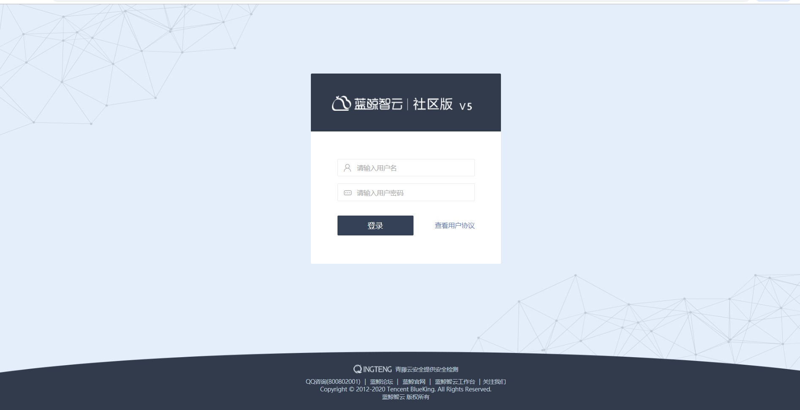
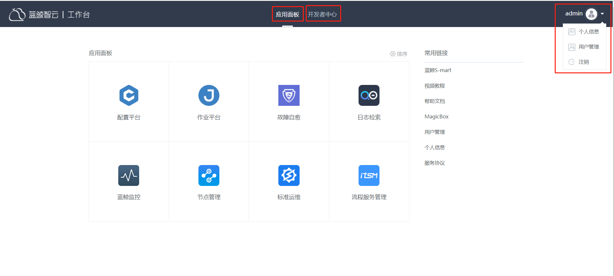
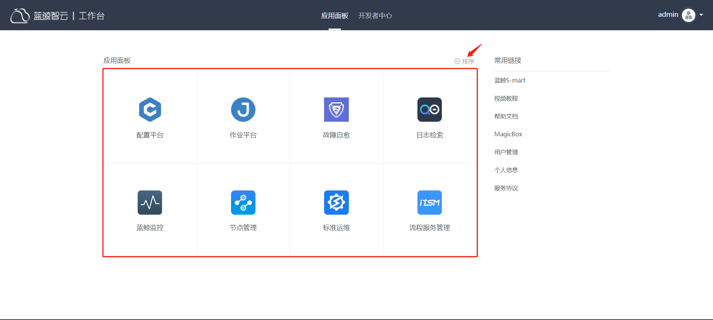
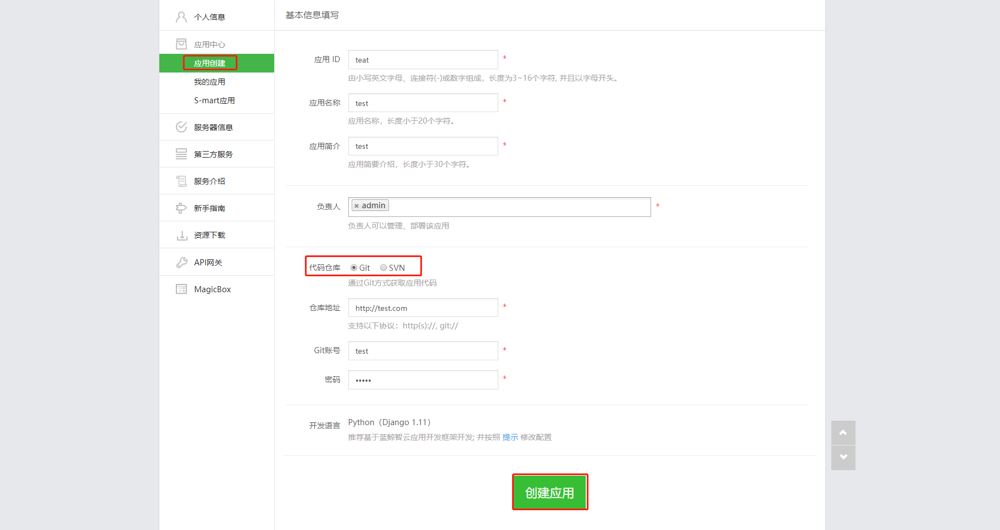
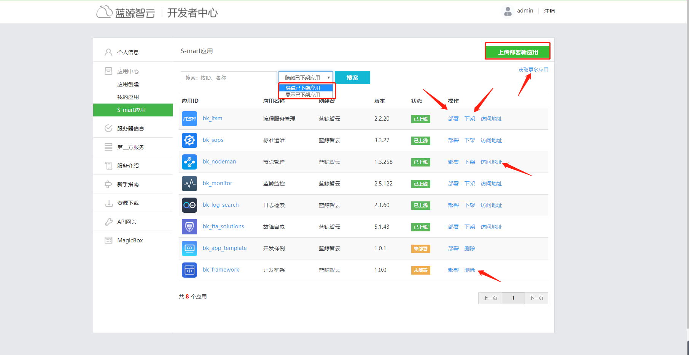
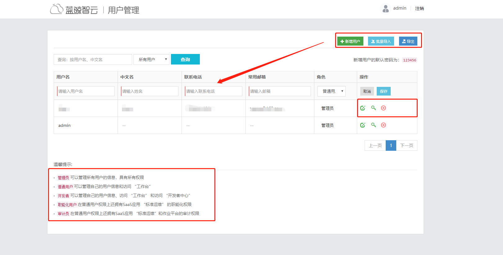
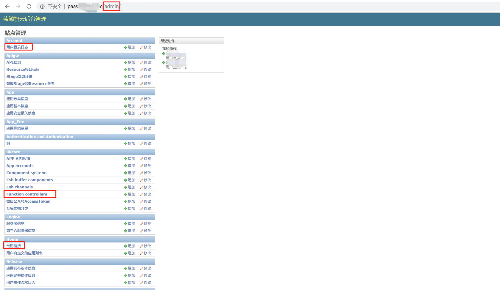
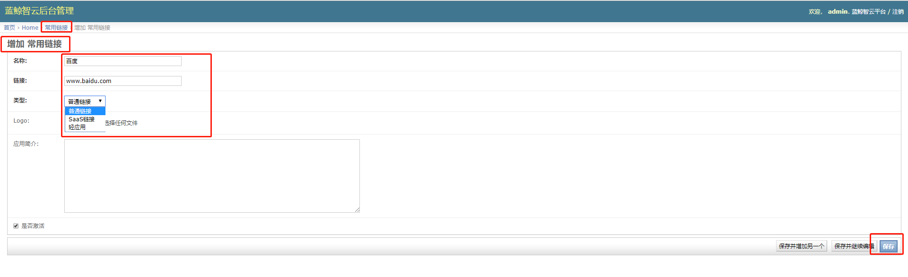
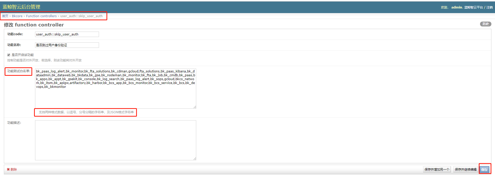

### 蓝鲸paas平台的介绍

- 下图所示：点击“登录”，会登录到自己的工作台，工作台有应用面板、开发者中心、用户管理三大模块

  
  

#### 【应用面板】

- 蓝鲸提供的saas会统一展现在自己的工作台，其中，可以通过“排序”的方式调整 SaaS 系统的入口。常用链接可以通过后台进行添加，删除。

   

#### 【开发者中心】

**1. 应用创建**

- 根据自己公司的需求开发saas，

    

**2. s-mart应用**

- 点击右上角“获取更多应用”下载满足自己需求的saas安装包，点击“上传部署新应用”进行对saas的部署

- 点击右边的“部署”、“下架”、“访问地址”可以对已有的saas进行重新部署，下架saas，访问saas等操作

- 点击“删除”可以删除掉未部署的saas

   

####【用户管理】

- 点击amdin-->用户管理

   1）下图所示，左下角的温馨提示有各个角色的权限及作用

   2）单独增加用户，点击“新增用户”，填写相应的信息，以及选择相应的角色

   3）批量导入用户，点击“批量导入”，上传相应的文件（按格式填写信息）

   4）批量导出用户，点击“导出”，以excel格式导出所用用户的信息

   5）操作那一栏三个按钮可以对用户进行编辑信息，重置密码，删除等操作

   

####【后台管理】

- 下图所示，在域名后面加上admin，回车，可以对站点进行管理

   

   比如：

**1. 添加常用链接：**

- 点击常用链接，填写名称，链接，可以选择类型，然后保存，这样就创建了一个常用链接，会在自己的工作台展现

   

**2. 添加白名单：**
- 自己创建的应用，需要在后台添加权限，才可以访问，在白名单里填写saas的应用id

   
