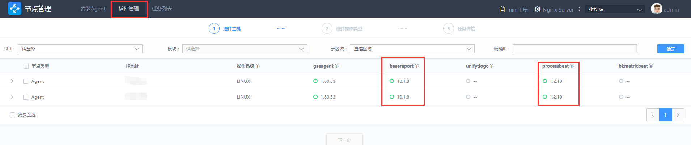

### 数据链路原理：

#### 采集器术语解释
1. baserepor 主机基础性能采集器，主要负责主机系统，硬件配置，CPU、内存、磁盘实时状态的采集和上报，应用于CMDB上的实时数据，蓝鲸监控里的主机监控数据
2. gsecmdline 自定义上报命令行工具，应用于蓝鲸监控的脚本采集，自定义监控，数据平台自定义上报数据
3. unifytlogc 高性能日志采集器，主要负责主机上特定日志文件的过滤，采集和上报，应用于蓝鲸监控自定义上报
4. bkmetricbeat 主机组件性能采集器，采集组件的metric信息，支持Redis，Apache，Nginx等组件，也支持对接promethues的exporter，应用于蓝鲸监控里的组件监控
5. processbeat 主机进程性能采集，采集主机进程监听端口状态和资源性能信息，应用于蓝鲸监控主机监控里面的进程信息
6. uptimecheckbeat 拨测监控采集器

#### 蓝鲸数据链路总览
1. 蓝鲸监控主机sys数据采集上报流程：

   basereport—>gse_data—>pre_kafka—>etl—>post_kafka—>shipper—>influxdb

2. 蓝鲸日志检索数据上报流程（日志检索是增量查询，需要有新增数据才会上报数据）

   unifytlogc—>gse_data—>pre_kafka—>etl—>post_kafka—>shipper—>es

3. 蓝鲸配置平台基础数据上报流
  * 社区版5.1

      basereport—>gse_data—>redis

  * 社区版5.0及其之前版本

    basereport—>gse_data—>pre_kafka—>etl—>post_kafka—>shipper—>redis

采集器是安装agent的过程中同时下发到agent机器上的，其中basereport和processbeat是安装agent就会默认启动的，其他采集器需要有相应的配置才会启动。

可到agent机器查看进程是否存在或者在"节点管理"—>"插件管理"中可以查看到采集器的状态,如图

###### 登录中控机，脚本自检测数据链路是否正常：
   source /data/install/diagnose.rc && check_snapshot

###### 采集器相关维护
   reload.sh restart.sh start.sh stop.sh

1. 如重启basereport采集器

   手动启动主机基础性能采集器
*  linux：
   -  /usr/local/gse/plugins/bin/start.sh basereport -c /usr/local/gse/plugins/etc/basereport.conf       
   -  ps -ef |grep basereport查看basereport进程
* windows：
  - C:\gse\plugins\bin\start.bat basereport -c ../etc/basereport.conf
  - tasklist|findstr basereport  查看basereport进程

2. 手动启动进程监控采集器
* linux：
  /usr/local/gse/plugins/bin/start.sh processbeat -c /usr/local/gse/plugins/etc/processbeat.conf

* windows：
  - C:\gse\plugins\bin\start.bat processbeat -c ../etc/processbeat.conf
  - tasklist|findstr processbeat 查看processbeat进程

3. 如查看basereport采集器版本

   /usr/local/gse/plugins/bin/basereport -v  

4. 采集器配置文件路径

   /usr/local/gse/plugins/etc/

5. agent日志及其采集器日志文件路径（采集器的日志等级默认为error级别，若是进程正常且没有日志文件，该采集器一般正常，可调整日志等级）

   /var/log/gse/

6. 采集器常见问题排查：

  - 若是部分机器有数据，部分机器无数据。先确定这些无数据上报机器的时间和蓝鲸server的时间是否同步（要求时间同步，否则上报数据的时间超前或者滞后都是不对的）
  - 再检查采集器进程是否存在，日志是否报错
